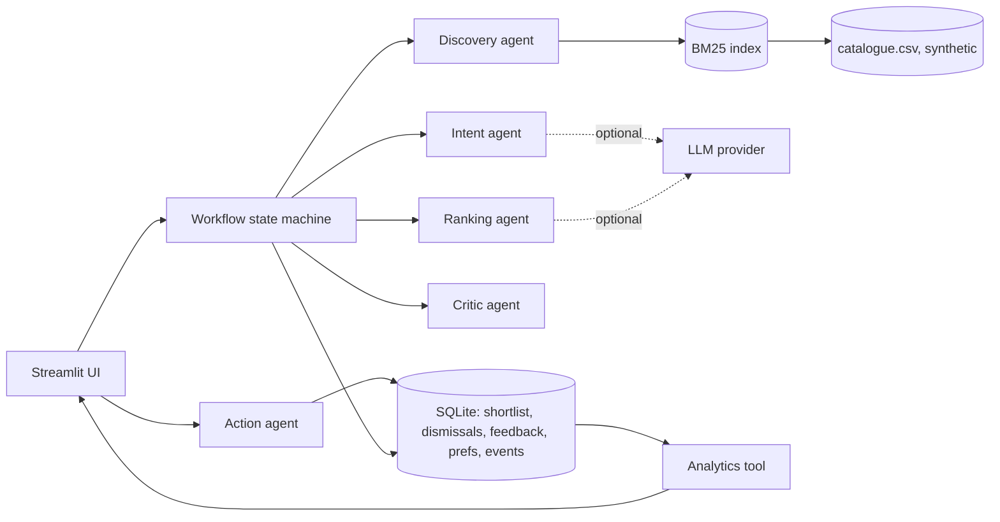
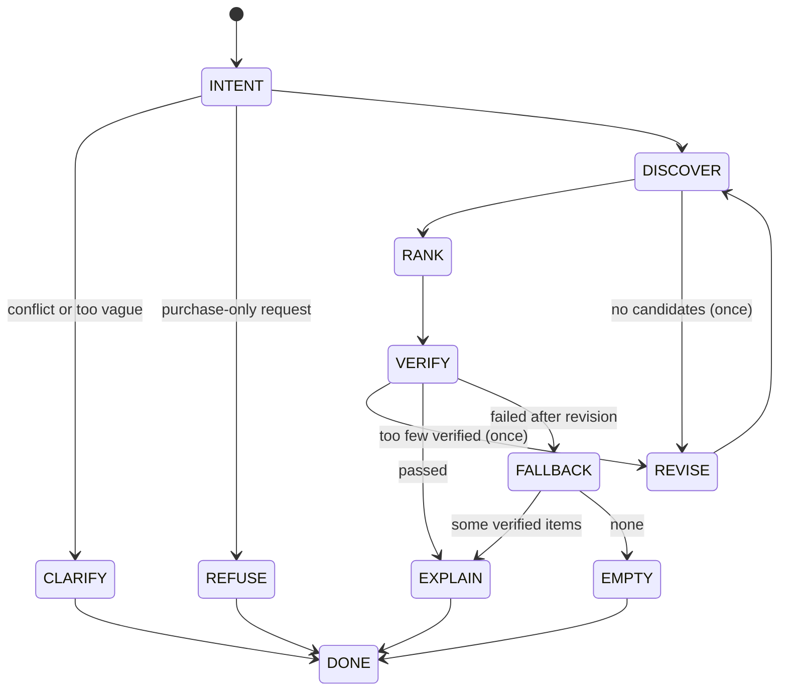

# GlanceFlow AI — Agentic Personal Discovery & Action Engine

An **independent portfolio prototype**: describe what you need in plain language ("a thoughtful gift under ₹1,500 for a friend who loves reading, prefers practical things, and dislikes generic gifts"), and a small orchestrated agent system finds options in a catalogue, ranks them with a transparent score, **verifies every hard constraint in code**, explains each pick from catalogue facts, and lets you save, compare, dismiss and refine.

## Problem and hypothesis
People face information overload, generic recommendations and friction when narrowing options. **Hypothesis to test (not a fact):** users find relevant products with less effort when a system understands intent, personalises, explains, and helps with the next action. See [PRD](docs/PRD.md).

## What is implemented
- Natural-language request → structured constraints (rule parser; optional LLM extractor whose output is schema-checked and fact-checked against the request).
- Local catalogue (283 valid synthetic items after ingestion), BM25 retrieval, hard filtering, de-duplication, preference-aware scoring, diversity-aware selection.
- Critic agent: deterministic verification of budget, availability, catalogue facts, duplicates, exclusions, injection text and hallucinated IDs; **one bounded revision**; safe fallback.
- Action agent: save / unsave (with confirmation) / dismiss / compare / feedback; idempotent, permission-checked, success confirmed by re-reading storage. **No purchases exist.**
- Persistent event log (13 event types) and analytics computed from it; seeded demo events are flagged and separable.
- Offline benchmark (30 fixed queries, 3 systems), demo experiment-assignment, 80 automated tests.
- Streamlit UI: Discover, Results, Shortlist, Agent activity, Analytics, Settings/Trust.
- Works **without any API key** (documented deterministic fallback).

## Architecture


## Agent workflow

Illegal transitions raise, and total steps are capped (`max_workflow_steps=12`), so the loop cannot run away. Details: [SYSTEM_ARCHITECTURE](docs/SYSTEM_ARCHITECTURE.md).

## Stack and rationale
Python 3.10+, **Streamlit** (fastest verifiable consumer-style UI), **Pydantic** (typed agent contracts), **SQLite** (local, reproducible, zero setup), **pandas/Plotly** (dashboard), pure-Python **BM25** (no embedding API dependency; retriever is a swappable `Protocol`). No FastAPI or microservices: they would add moving parts without user value at this scope.

## Install and run
```bash
cd glanceflow-ai
python3 -m pip install -r requirements.txt
cp .env.example .env                 # optional; the app works with defaults
python3 scripts/generate_data.py     # writes data/catalogue.csv + data/evaluation_queries.json
python3 scripts/initialize_db.py     # creates data/glanceflow.db
streamlit run app.py                 # http://localhost:8501
python3 -m pytest                    # 80 tests
python3 scripts/run_evaluation.py    # offline benchmark -> docs/evaluation_results.json
```
Or `make setup data db run`, `make test`, `make eval`, or `bash scripts/run_demo.sh` (does everything, then launches).

### Optional LLM
Set `GLANCEFLOW_LLM_PROVIDER=anthropic` and `ANTHROPIC_API_KEY` in `.env`, then switch on **Settings → Allow sending my request text to the external LLM**. It is off by default even when configured. LLM output is never trusted: extracted budgets must appear in your text and generated explanations may contain only the item's price or your budget. **The live-API path was not exercised in this build** (no key); it is covered only by fake-LLM tests.

## Example journeys
1. *Gift with constraints:* the example prompt → 5 diverse, in-budget, in-stock items, each with reasons → Save two → Compare → Shortlist persists after restart.
2. *Refine:* "make it cheaper" lowers the budget to 75% of the previous cap; "actually she's into cooking now" **replaces** interests instead of appending.
3. *Guardrails:* "Buy this for me now" → clear refusal; "under ₹500 but at least ₹900" → one clarification question; "scuba diving under ₹100" → honest empty state.

## Evaluation (measured, offline, synthetic)
23 answerable queries, top-5, relevance labels defined by catalogue tags (so optimistic; see [EVALUATION_REPORT](docs/EVALUATION_REPORT.md)):

| Metric | A keyword | B keyword + hard filters | C intent-aware (full) |
|---|---|---|---|
| Precision@5 | 0.443 | 0.739 | 0.974 |
| Hit rate@5 | 0.783 | 0.913 | 1.000 |
| Constraint-violation rate | 44.3% | 0% | 0% |
| Avg distinct base products in top-5 | 2.39 | 2.61 | 4.22 |
Edge-case handling (clarify / refuse / no-match): 7 of 7. **Not** proof of real-world impact.

## Tests actually run
`python3 -m pytest` → **80 passed** (77 logic tests + 3 headless UI journeys via Streamlit `AppTest`). The server also started and returned HTTP 200 on its health endpoint. See [EVALUATION_REPORT](docs/EVALUATION_REPORT.md) for what was *not* verified.

## Screenshots to capture (not included)
No headless browser was available in the build environment, so screenshots were **not** captured. Capture, at 1280px and 390px width: (1) Discover with the example prompt; (2) Results for the example prompt; (3) comparison table; (4) Agent activity with a revision or a failed check; (5) Analytics with seeded data; (6) Settings. Save under `assets/`.

## Security and privacy
Local by default; no key needed; external LLM is opt-in per session; catalogue text is untrusted (3-layer injection screen, HTML-escaped in the UI); events store structured properties, not raw prompts (only `query_chars`); one-click clear/reset. See [SAFETY_AND_PRIVACY](docs/SAFETY_AND_PRIVACY.md).

## Known limitations
Synthetic catalogue; single demo profile and no auth; no real users, no real images; BM25 not semantic; benchmark labels are tag-derived; latency numbers are from a small single-core sandbox. Full list: [LIMITATIONS](docs/LIMITATIONS.md).

## Roadmap
Embedding retrieval behind the existing `Retriever` protocol; learned ranking from real feedback; content (not just product) catalogue; multi-user profiles with auth; a real A/A then A/B test per [EXPERIMENT_PLAN](docs/EXPERIMENT_PLAN.md).
